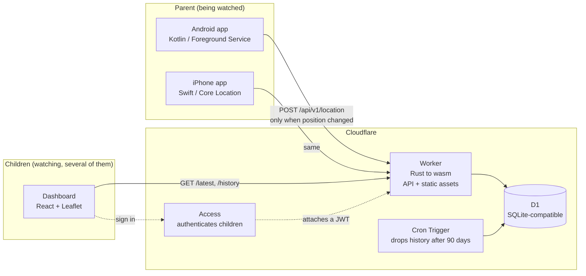
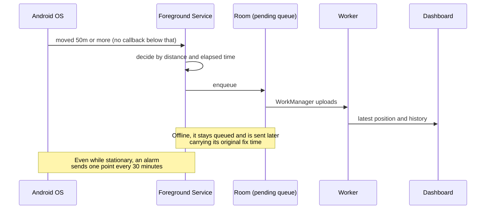

# chikaku

A location-monitoring system that lets adult children keep track of an elderly
parent who lives apart from them.

[日本語](README.md) | English

*"Chikaku" (ちかく) is Japanese for "nearby".*

---

## The problem

You want to know where your parent is. But **polling for location continuously
will burn through the battery of their phone**. For something an elderly parent
will actually keep running, battery life is the binding constraint.

So the system is **event-driven: it transmits only when the location actually
changes**. While they are sitting at home, no location callback fires at all.
While they are not moving, it reports once every 30 minutes just to say it is alive.

> **Is the silence because they are sitting still, or because something broke?**
> Letting the children tell those apart is what the design is built around.

## Architecture

**A single Worker serves both the API and the dashboard's static files from the
same origin** ([ADR-2](docs/architecture-decisions.md)). There is no CORS and no
preflight anywhere.

**The server owns no credentials for the children.** Authentication is delegated
to Cloudflare Access; the server matches the `email` claim of the Access-issued
JWT against `children_accounts` ([ADR-3](docs/architecture-decisions.md)).
**No password is ever stored.**

## How a location reaches the dashboard

**Fix time and receive time are stored separately.** A queue that sat offline for
hours can arrive late without corrupting the ordering of the history, or the
answer to "where were they at the time".

## Stack

| | | |
|---|---|---|
| Parent app (Android) | Kotlin | Foreground Service, WorkManager, Room, DataStore, Jetpack Compose |
| Parent app (iPhone) | Swift | Core Location (SLC + standard updates), SwiftData |
| Server | Rust | Cloudflare Workers (workers-rs) to wasm, D1 |
| Dashboard | TypeScript | Vite, React, Leaflet + OpenStreetMap |
| Auth | — | Cloudflare Access (children) / device token (parent) |

## The interesting parts

**After a reboot, monitoring did not resume until the screen was unlocked**
([#3](https://github.com/abekatsu/chikaku/issues/3)). `BOOT_COMPLETED` is not
delivered until the first unlock. In real data the process did not start until
**2,217 seconds after boot**.

Receiving `LOCKED_BOOT_COMPLETED` means moving the state needed for that decision
into device-protected storage. **The `device_token` was deliberately left behind.**
Before unlock the app only fixes and queues; it does not upload. That way the
Direct Boot support costs no additional exposure of the secret. Measured on a real
device, the delay dropped to **3 seconds**.

**On the server, `NULL` means "not reported yet", not "no problem"**
([#4](https://github.com/abekatsu/chikaku/issues/4)). Filling the device-health
columns with 0/1 would raise warnings on devices that simply cannot report — the
iOS build and older Android builds. It is kept as a distinct third state.

**Getting the storage migration wrong would wipe the parent's pairing.** The old
files are not deleted until the move has succeeded. If the source and destination
resolve to the same file, that is a misconfiguration rather than a failed
migration, so it is logged and refused instead of swallowed — this actually
happened once.

## Status

**The MVP works end to end in production**: pairing by invite code, location
upload, dashboard display (polling), and automatic deletion after 90 days.

**The biggest live problem is that the app is not exempt from battery
optimisation** ([#4](https://github.com/abekatsu/chikaku/issues/4)). On a real
drive the OS froze the app: only the 30-minute heartbeat points survived, and
uploads were delayed by up to 74 minutes. **The dashboard now surfaces the reason
for that failure** rather than just going quiet.

| | |
|---|---|
| Automated tests | 33 server e2e / 13 Android unit / 12 iOS wire-contract |
| Not implemented | FCM Web Push (phase 2), geofencing (phase 3) |

**Exactly what has and has not been verified on a real device is written out in
§7 of [docs/implementation-status.md](docs/implementation-status.md).** Nothing
unverified is described as working.

## Running it

See [docs/getting-started.en.md](docs/getting-started.en.md).
Locally, `npm install && npm run dev` brings up the Worker, a local D1, and a
**stand-in for Cloudflare Access** in one command.

## Documentation

| | |
|---|---|
| [docs/architecture-decisions.md](docs/architecture-decisions.md) | Decisions and the options that were rejected (ADR-1 to 6) — Japanese |
| [docs/authentication.md](docs/authentication.md) | Auth and authorisation design — Japanese |
| [docs/implementation-status.md](docs/implementation-status.md) | Status, on-device verification results, open work — Japanese |
| [docs/getting-started.en.md](docs/getting-started.en.md) | Development setup and deployment |
| [CLAUDE.md](CLAUDE.md) | The specification, and the guidance Claude Code follows — Japanese |
| [server/README.md](server/README.md) | Cloudflare-side setup and operations — Japanese |

## Built with Claude Code

**The code, documentation, and commit messages in this repository were written
using [Claude Code](https://claude.com/claude-code).**

The working arrangement: the specification and the ground rules live in
[CLAUDE.md](CLAUDE.md); decisions that involve a real trade-off — such as whether
to move `device_token` into device-protected storage — are made by a human and
recorded as an [ADR](docs/architecture-decisions.md).

On-device debugging was also driven from Claude Code, through `adb` and
`wrangler`. **The "2,217 seconds to 3 seconds" and the "74-minute delay" above
are measurements taken that way**, not estimates.

## Licence

A personal project.
