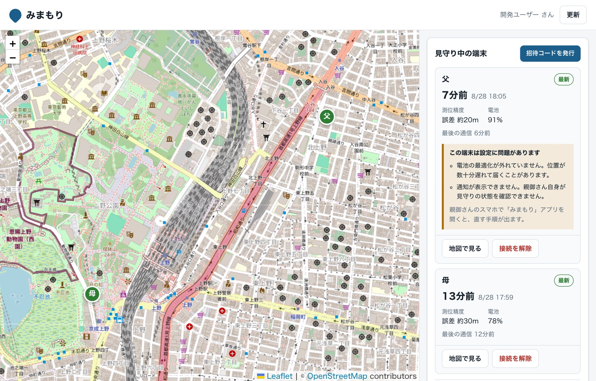
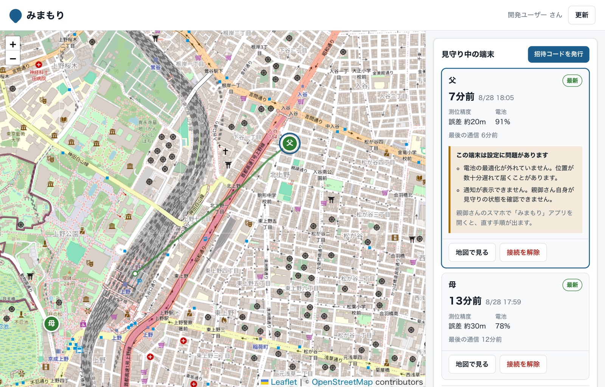
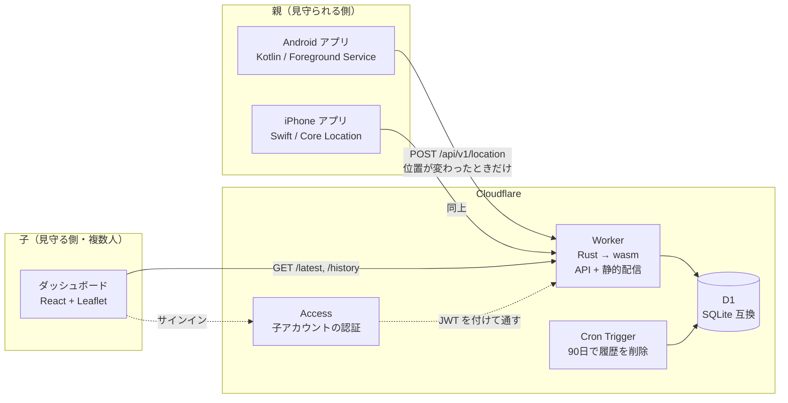
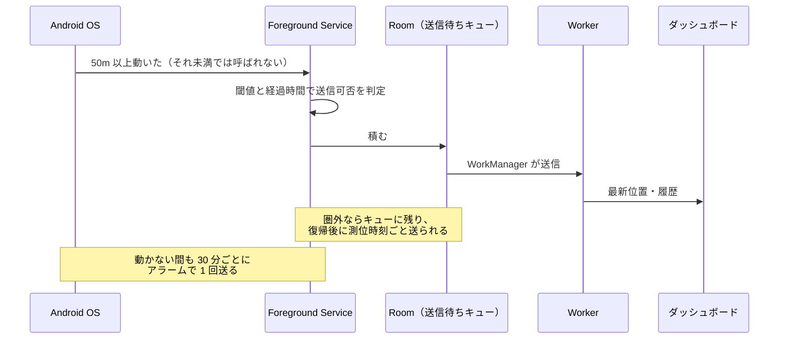

# chikaku（ちかく）

離れて暮らす高齢の親の居場所を、複数の子が常時把握できるようにする見守りシステム。

日本語 | [English](README.en.md)

---

## 何を解決するか

親の居場所を知りたい。しかし**常時ポーリングは親のスマホの電池を焼き切る**。
実際に高齢の親が使い続けられるものにするには、電池が最優先の制約になる。

そこで**「位置が実際に変化したときだけ通信する」イベント駆動**にしている。
家で座っている間は測位コールバックすら発生しない。動いていない間も、
30分に1回だけ「生きている」ことを知らせる。

> **「送られてこない」のが静止なのか、それとも壊れているのか。**
> これを子側から区別できることが、この設計の要になっている。

## 画面

子はブラウザでこれを開く。**注目してほしいのは右上の警告**で、
「電池の最適化が外れていない」「通知が表示できない」と出ている。
親の端末がそれを自分で申告してくる（[#4](https://github.com/abekatsu/chikaku/issues/4)）。
**見守りが静かに壊れているとき、その理由が子側に見える。**

「母」の端末には警告が出ていない。**問題が無いからではなく、iOS 版がまだ
健康状態を報告しないから**で、サーバーはそれを `NULL`（未報告）として
「問題なし」と区別している。

端末を選ぶと移動の履歴を重ねられる。点が疎なのは、**動いた分だけ記録する**
設計だからで、止まっている間は 30 分に 1 度しか点が増えない。

> 画面はローカルの開発環境にダミーのデータを入れて撮ったもの。
> 実在の家族の位置ではない。

## アーキテクチャ

**1つの Worker が API とダッシュボードの静的ファイルを同じオリジンから配る**
（[ADR-2](docs/architecture-decisions.md)）。CORS もプリフライトも存在しない。

**子側の認証は自前で持たない。** Cloudflare Access に委ね、サーバーは
Access が発行した JWT の `email` クレームと `children_accounts` を突き合わせる
（[ADR-3](docs/architecture-decisions.md)）。**パスワードを一切保存しない。**

## 位置が届くまで

**測位時刻と受信時刻を別々に保存している。** 圏外で何時間も滞留したキューが
あとから届いても、履歴の順序と「いつそこに居たか」が壊れない。

## 技術構成

| | | |
|---|---|---|
| 親アプリ（Android） | Kotlin | Foreground Service, WorkManager, Room, DataStore, Jetpack Compose |
| 親アプリ（iPhone） | Swift | Core Location（SLC + 標準更新）, SwiftData |
| サーバー | Rust | Cloudflare Workers (workers-rs) → wasm, D1 |
| ダッシュボード | TypeScript | Vite, React, Leaflet + OpenStreetMap |
| 認証 | — | Cloudflare Access（子側）／ 端末トークン（親側） |

## 技術的に踏み込んだところ

**再起動後、画面ロックを解除するまで見守りが復帰しなかった**
（[#3](https://github.com/abekatsu/chikaku/issues/3)）。`BOOT_COMPLETED` は
最初のロック解除まで配信されない。実データでは再起動の **2217 秒後**に
ようやくプロセスが起動していた。

`LOCKED_BOOT_COMPLETED` を受けるには、起動判断に要る状態を端末保護ストレージへ
移す必要がある。**ただし `device_token` は移さなかった。** ロック解除前は
測位してキューに積むまでとし、送信はしない。そうすれば秘密の露出が増えない。
実機で **3 秒**に短縮したことを確認している。

**サーバーの `NULL` は「問題なし」ではなく「まだ報告を受けていない」**
（[#4](https://github.com/abekatsu/chikaku/issues/4)）。端末設定の健康状態を
0/1 で埋めると、報告できないだけの端末（iOS 版・旧アプリ）に警告が出てしまう。
第三の状態として区別している。

**移行を間違えると親の端末のペアリングが消える。** 保存先を移す際、旧ファイルは
移し終えるまで消さない。引き継ぎ元と先が同じファイルを指したら、それは移行の
失敗ではなく設定の誤りなので、握り潰さずログに残して止める（実際に一度踏んだ）。

## 実装状況

**MVP は実環境で通しで動いている。** 招待コードでのペアリング、位置の送信、
ダッシュボードでの表示（ポーリング）、90日での自動削除まで。

**現時点の一番の問題は電池の最適化から除外されていないこと**
（[#4](https://github.com/abekatsu/chikaku/issues/4)）。実走行では
OS がアプリを凍結し、走行中は 30 分間隔の点しか残らず、送信は最大 74 分遅れた。
**この不調の理由自体はダッシュボードに表示される**ようにしてある。

| | |
|---|---|
| 自動テスト | サーバー e2e 33件 / Android 単体 13件 / iOS 通信契約 12件 |
| 未実装 | FCM Web Push（フェーズ2）、ジオフェンス（フェーズ3） |

**何を実機で確かめ、何をまだ確かめていないかは
[docs/implementation-status.md](docs/implementation-status.md) の §7 に
すべて書いてある。** 検証していないことを「動く」と書かないようにしている。

## 動かす

[docs/getting-started.md](docs/getting-started.md) を参照。
ローカルは `npm install && npm run dev` で、Worker・ローカル D1・
**Cloudflare Access の代役**まで一括で起動する。

## ドキュメント

| | |
|---|---|
| [docs/architecture-decisions.md](docs/architecture-decisions.md) | 構成上の判断と、選ばなかった案の理由（ADR-1〜6） |
| [docs/authentication.md](docs/authentication.md) | 親端末と子アカウントの認証・認可の設計 |
| [docs/implementation-status.md](docs/implementation-status.md) | 実装状況、実機での検証結果、残課題 |
| [docs/getting-started.md](docs/getting-started.md) | 開発環境の構築と配備手順 |
| [CLAUDE.md](CLAUDE.md) | 仕様書。Claude Code が実装を進める際の指針 |
| [server/README.md](server/README.md) | Cloudflare 側のセットアップと運用 |

## Claude Code で作っている

**このリポジトリのコード・ドキュメント・コミットメッセージは
[Claude Code](https://claude.com/claude-code) を使って書いている。**

進め方は、[CLAUDE.md](CLAUDE.md) に仕様と方針を置き、
判断が要る場面（`device_token` を端末保護ストレージに出すか、など）は
人間が決めて [ADR](docs/architecture-decisions.md) に残す、という形にしている。

実機のデバッグも Claude Code から `adb` と `wrangler` を叩いて行った。
**上に書いた「2217 秒 → 3 秒」も「74 分の遅延」も、そうやって取った実測値である。**

## ライセンス

個人プロジェクト。
