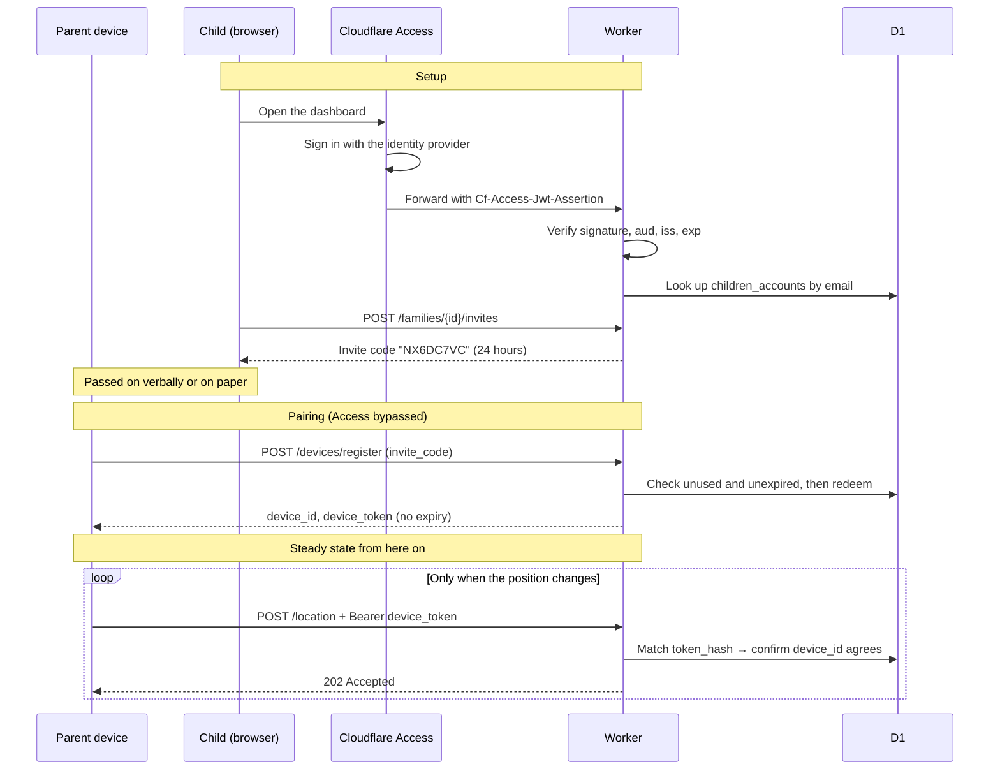

*[日本語版](authentication.md)*

# Authentication and authorization design

Covers `server/` (Cloudflare Workers / Rust) and its callers, `android-app/`
and `client/`.
Related: CLAUDE.md §5 (privacy and security),
[architecture-decisions.en.md](architecture-decisions.en.md)

This document exists to record *why* each approach was chosen. How to call the
API is in `server/README.en.md`.

> **Revision note**: the first version carried its own passwords (Argon2id) and
> session tokens. ADR-3 handed child-account authentication to Cloudflare
> Access, so that part has been rewritten entirely. The parent-device design is
> unchanged.

---

## 1. Approach

There are two kinds of actor, and they are nothing alike.

| | Parent device (Android) | Child account (dashboard) |
|---|---|---|
| Actor | A machine. Nobody operates it | A person, from a browser |
| Frequency | Intermittent, only when the position changes | Whenever they want to look |
| Re-authentication | **Impossible** — an elderly parent cannot be asked to type it again | Possible; Access shows a sign-in screen |
| How it is lost | Phone lost or replaced | Left open on a shared PC, account takeover |

Because of that difference, **the two are never given the same kind of
credential.** Parent devices get a dedicated token with no expiry; child
accounts are handed to Cloudflare Access.

The result is that **the authentication paths are fully separated by subject.**
They consult different mechanisms, so neither credential can reach the other's
API by construction.

---

## 2. The credentials

| | Parent `device_token` | Child account | Invite code |
|---|---|---|---|
| Issued by | `POST /devices/register` | Cloudflare Access | `POST /families/{id}/invites` |
| What it is | 32 OS-random bytes as hex (64 chars) | An Access JWT (RS256) | 8 characters |
| Stored as | **SHA-256 hex** | **Not stored** | Plaintext |
| Expiry | None | Access session settings | 24 hours by default |
| Revocation | The revoke API | Changing the Access policy | Used, or expired |
| Sent as | `Authorization: Bearer` | `Cf-Access-Jwt-Assertion`, added by Cloudflare | In the request body |

`device_token` **is never stored in the database in its original form.** It is
returned once in the response at issue time and the server keeps only the
SHA-256. If the database leaks, no usable impersonation token can be recovered
from it. Since the input is 32 uniformly random bytes, password-style
stretching (Argon2 and the like) is unnecessary, so plain SHA-256 is used.

**No password is stored anywhere.** Access handles authentication, so
`children_accounts` holds only an email address and a display name.

**Invite codes alone are stored in plaintext.** At eight characters, hashing
them would not survive dictionary attack, so the defence rests on a short
lifetime and single use instead. This is a conscious decision about a place
where the storage format cannot provide the strength.

---

## 3. Child-account authentication via Cloudflare Access

### Why hand it over

Owning it means owning rate limiting, password resets, session management and
the safe storage of hashes. For a system serving one family, leaning on
Cloudflare is safer than maintaining all of that correctly forever (ADR-3).

### The JWT is verified in our own code

Cloudflare's documentation states plainly that when a Worker also serves Static
Assets, **the Access context (`ctx.access`) is not passed to the Worker.** So
`src/access.rs` verifies the `Cf-Access-Jwt-Assertion` JWT itself.

**Reading the header is not enough.** Without verifying the signature, anyone
can impersonate a user by sending a request with that header attached.

What is checked:

| # | Check | On failure |
|---|---|---|
| 1 | `alg` is `RS256` — not whatever the JWT claims | 401 |
| 2 | A key matching `kid` exists in the JWKS | 401 |
| 3 | The signature verifies against the public key from `{TEAM_DOMAIN}/cdn-cgi/access/certs` | 401 |
| 4 | `aud` matches the Access application's AUD tag | 401 |
| 5 | `iss` matches the team domain | 401 |
| 6 | `exp` is in the future | 401 |
| 7 | No `common_name` — i.e. not a service token | 401 |

**Number 1 matters most**: honouring the JWT's own `alg` lets an attacker
substitute `none` or `HS256` and neutralise signature verification. Anything
other than RS256 is rejected outright.

**On number 7**: Access also issues JWTs for service tokens, with an empty
`sub` and a `common_name` present. The dashboard is for people, so machine
credentials are not accepted.

The JWKS is not fetched on every request; it is held in Cloudflare's cache for
an hour, which still follows key rotation.

### Passing Access is not sufficient on its own

The verified `email` is looked up in `children_accounts`, and **an address
absent from that table gets a 403** (`not_provisioned`). Narrowing through both
the Access policy and this table limits the damage if the Access configuration
is ever widened by mistake.

---

## 4. Parent devices sit outside Access

The Android app cannot perform an interactive login; the moment Access returns
a sign-in page, the app stops working. These routes are therefore configured as
an **Access bypass**:

```
POST /api/v1/devices/register   ← protected by the single-use invite code
POST /api/v1/location           ← protected by Bearer device_token
GET  /api/v1/healthz            ← returns nothing of substance
```

> **This is where a configuration mistake is directly a hole.** Forgetting the
> bypass stops the app; opening it too wide leaves the dashboard unprotected.
> Keep the Access application definitions exactly as tabulated in
> `server/README.en.md`.

---

## 5. How a request gets through



### Authentication happens at the entrance

`device()` and `child()` in `src/auth.rs` establish the subject from the
request. Handlers receive an already-resolved `DeviceAuth` or `ChildAuth`.

The revocation condition for parent devices (`revoked_at IS NULL`) is part of
the matching query's WHERE clause, so **a revoke takes effect from the very
next request.**

---

## 6. Two further authorization steps after authentication

A credential being genuine and the operation being permitted are different
things.

### 6.1 Impersonation (`routes/location.rs`)

If the payload's `device_id` disagrees with the `device_id` the token resolves
to, the answer is **401**. Holding a valid token does not allow posting
positions in another device's name.

### 6.2 Family scope (`ChildAuth::scope()`)

If the `family_id` in the path is not the caller's family, the answer is
**404, not 403.**

A 403 concedes that the resource exists but is off limits. Brute-forcing UUIDs
would then leak the very existence of other families. CLAUDE.md §5's
"unreachable from other families' data" is satisfied including the concealment
of existence.

---

## 7. Handling invite codes

```
issued → passed on verbally or on paper → typed into the device → spent
```

- **A 27-character alphabet**, with `0 1 2 B I L O S Z` removed. Elderly users
  read these off paper and type them, so easily confused characters are kept
  out from the start
- **Input normalisation**: case, hyphens and spaces are ignored when matching.
  `a3c4-d5e6` and `A3C4D5E6` are the same code
- **Single use**: inside a D1 `batch` (a SQL transaction), a conditional INSERT
  is combined with an UPDATE guarded by EXISTS. **It counts as successful only
  when both affect exactly one row**, so two simultaneous uses of the same code
  cannot both pass, and neither "device created but code not spent" nor "code
  spent but no device" can occur

> A D1 `batch` rolls back only when **a statement fails**, not when zero rows
> are updated. That is why the decision is made on row counts.

The space is 27^8 ≈ 2.8 × 10^11. Rate limiting on the registration route
(§5.5 of [implementation-status.en.md](implementation-status.en.md)) slows
single-connection brute force, but **it is a speed limit rather than a cap** —
an attacker spreading connections exceeds the configured value. The primary
defence remains the short lifetime and the size of the space.

---

## 8. Status codes and client behaviour

The branches in Android's `ApiClient.kt` and `UploadWorker.kt` depend on this.
**Changing the codes on the server changes the app's retry logic.**

| Code | Situation | App behaviour |
|---|---|---|
| 202 | Position accepted | Remove from the queue |
| 400 | Invalid time, coordinates or battery level | Stop retrying and discard |
| 401 | Token revoked / bad invite code / impersonation / bad JWT | Re-pair |
| 403 | Passed Access but the email is not registered | — |
| 404 | Referred to another family's ID | — |
| 429 | Rate limited | Retry later |
| 5xx | Server-side problem | Retry later |

401 also covers "bad invite code" because the app is written to show its own
Japanese message (`pairing_error_invalid_code`) when it receives
`Unauthorized`. Conversely, the `message` on a 4xx goes straight onto an
elderly user's screen, so it is written in plain Japanese without jargon.

---

## 9. Lifecycle and cleanup

A Cron Trigger every six hours calls `src/retention.rs`.

| Target | Deleted when |
|---|---|
| Location history | `recorded_at` is older than the retention period (90 days by default) |
| Invite codes | Expired without being used |

Spent invite codes are kept, so it remains possible to trace which device
registered with which code. A revoked parent device keeps its row; only
`revoked_at` is set.

Child-account sessions do not exist server side — Access manages them — so
there is nothing to clean up.

---

## 10. Known limitations

Things that are implemented and accepted as they are for now.

| Item | Current state | Impact |
|---|---|---|
| Rate limiting is a speed limit, not a cap | Implemented via the Worker's `ratelimit` binding (§5.5 of implementation-status) | The counter is held per Cloudflare location, so spreading connections exceeds the configured value. It slows single-connection brute force rather than capping attempts |
| `device_token` has no expiry | Revocable only | A lost phone keeps sending until somebody notices |
| Token matching is not a constant-time comparison | SHA-256 primary key lookup | Judged harmless, since the input is high-entropy random |
| Invite codes stored in plaintext | See §2 | If the database leaks, unexpired unused codes are usable |
| No audit log | Structured logging only | There is no way to trace who viewed a position and when |
| Dependence on Access | Authentication assumes Cloudflare | Dropping Access means building a login system from scratch |

Rate limiting of login attempts and password resets **stopped being our
problem** when authentication moved to Access; both were on the first version's
list of limitations.

---

## 11. Corresponding code and tests

| Concern | Implementation |
|---|---|
| Access JWT verification | `server/src/access.rs` |
| Resolving the subject (device / child) | `server/src/auth.rs` |
| Token generation, hashing, invite codes | `server/src/token.rs` |
| Pairing | `server/src/routes/devices.rs` |
| Impersonation checks | `server/src/routes/location.rs` |
| Family scope | `server/src/routes/families.rs` |
| Cleanup | `server/src/retention.rs` |
| Route list and bypass targets | `server/src/lib.rs` |

The tests that pin this design live in `server/tests/e2e.mjs`.
**Access verification is not bypassed** — a test RSA key drives the same code
path as production.

- An invite code can only be used once
- An invite code works with lowercase and hyphens mixed in
- Posting in another device's name returns 401
- Another family's data is unreachable (404, not 403)
- A device token cannot call the dashboard API
- A JWT with a tampered signature returns 401
- **A JWT with only the claims substituted returns 401**
- Expired, wrong `aud`, wrong `iss` and unknown `kid` JWTs all return 401
- A service-token JWT returns 401
- An email that passes Access but is not registered returns 403
- A revoked device can no longer send

**When changing this design, fix those tests first.** Each one states in its
name why the behaviour is what it is.
