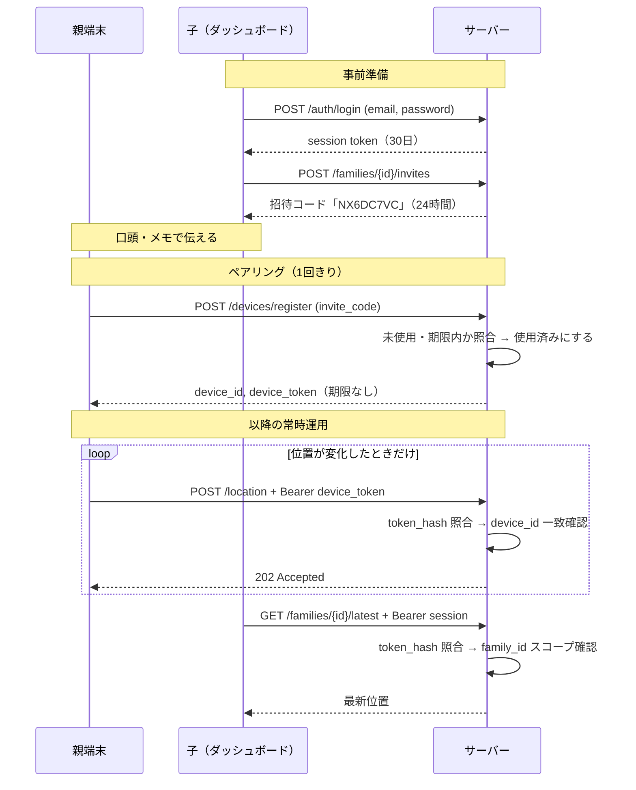

# 認証・認可の設計

対象: `server/`（Rust / Axum）と、それを呼ぶ `android-app/`・`client/`。
関連: CLAUDE.md §5（プライバシー・セキュリティ）

このドキュメントは「なぜその方式にしたか」を残すためのもの。
API の呼び出し方そのものは `server/README.md` を参照。

---

## 1. 方針

登場人物は2種類で、性質がまったく違う。

| | 親端末（Android） | 子アカウント（ダッシュボード） |
|---|---|---|
| 主体 | 機械。人が操作しない | 人。ブラウザから操作する |
| 頻度 | 位置が動いたときだけ、断続的 | 見たいときに随時 |
| 再認証 | できない（高齢の親に再入力させられない） | できる（ログイン画面を出せる） |
| 失われ方 | 端末の紛失・機種変更 | パスワード漏洩・共用PCへの放置 |

この違いから、**両者を同じ資格情報で扱わない**方針を採った。
親端末には期限のない専用トークンを配り、子アカウントには期限付きの
セッションを発行する。

### 不透明トークン（opaque token）を選んだ理由

JWT ではなく、サーバー側の DB に実体を持つランダム文字列にしている。

- **失効が即座に効く。** 端末を紛失したとき、次のリクエストから確実に止まる。
  JWT は署名が有効な限り通ってしまうため、失効リストを別に持つことになり、
  結局サーバー側に状態を置くのと変わらない
- **家族数人という規模で、ステートレスである利点がない。**
  水平スケールも複数サービス間での検証も要らない
- **トークンに情報を載せない。** `family_id` や `device_id` をクライアントに
  配る必要がなく、照合は毎回 DB を引く

---

## 2. 資格情報の一覧

| | 親端末 `device_token` | 子セッション | 招待コード | パスワード |
|---|---|---|---|---|
| 発行元 | `POST /devices/register` | `POST /auth/login` | `POST /families/{id}/invites` | CLI (`create-family`) |
| 実体 | OS乱数32バイトのhex（64文字） | 同左 | 8文字 | 利用者が決める |
| 保存形式 | SHA-256 hex | SHA-256 hex | **平文** | Argon2id (PHC) |
| 有効期限 | なし | 既定30日 | 既定24時間 | なし |
| 失効手段 | revoke API | logout / 期限切れ | 使用済み・期限切れ | ― |
| 送り方 | `Authorization: Bearer` | 同左 | リクエスト本文 | 同左 |

トークン類は**原文を DB に保存しない**。発行時の応答で一度返すきりで、
サーバーには SHA-256 しか残らない。DB が漏れても、そこから成りすませる
トークンは復元できない。

入力が32バイトの一様乱数なので、パスワードのようなストレッチ（Argon2 等）は
不要と判断して素の SHA-256 にしている。総当たりの対象になる強度ではない。

**招待コードだけは平文で保存している。** 8文字と短く、ハッシュ化しても
辞書化に耐えないため、防御は「短い有効期限」と「一回きり」に寄せている。
ここは強度を保存形式で稼げない箇所だと認識した上での判断。

---

## 3. 認証を要求しない入口

3つだけ。それ以外は全て Bearer トークンを要求する。

| パス | 代わりに何で守るか |
|---|---|
| `POST /api/v1/devices/register` | 招待コード（一回きりの引換券） |
| `POST /api/v1/auth/login` | メールアドレス＋パスワード |
| `GET /healthz` | 何も返さない（`"ok"` のみ） |

---

## 4. リクエストが通る道筋



### 検証は extractor で強制する

`src/auth/extract.rs` の `DeviceAuth` / `ChildAuth` は axum の
`FromRequestParts` として実装してある。ハンドラの引数にこの型を書くと、
**本体に入る前に認証が完了している**。

```rust
pub async fn create(
    State(state): State<AppState>,
    auth: DeviceAuth,          // ← ここを書いた時点で認証済み
    Json(req): Json<LocationRequest>,
) -> AppResult<...>
```

ミドルウェアで「このパスは認証が要る」と列挙する方式だと、
ルートを足したときに書き忘れて素通りする。型で表現しておけば、
`auth.device_id` を使う限りコンパイラが漏れを防ぐ。

照合の中身:

```
Authorization ヘッダ
  → Bearer スキーム判定（大小無視・RFC 7235）
  → SHA-256
  → DB 照合（親: revoked_at IS NULL / 子: expires_at > now）
  → 見つからなければ 401
```

失効条件を照合クエリの WHERE に入れているので、revoke もログアウトも
**次のリクエストから即座に効く**。

---

## 5. 認証の後に、さらに2段の認可

トークンが本物であることと、その操作をしてよいことは別。

### 5.1 なりすまし防止（`routes/location.rs`）

ペイロードの `device_id` と、トークンから引いた `device_id` が
食い違えば **401**。有効なトークンを持っていても、他端末を名乗って
位置を投稿することはできない。

### 5.2 家族スコープ（`ChildAuth::scope()`）

パスの `family_id` がセッションの家族と違えば **403 ではなく 404** を返す。

403 は「実在するが権限がない」ことを認めてしまう。UUID を総当たりされた
とき、他家族の存在そのものが漏れる。CLAUDE.md §5 の
「他家族のデータに到達不可」は、存在の秘匿まで含めて満たす。

### 5.3 トークンの種類は混ざらない

親端末トークンと子セッションは参照するテーブルが違うため、
**端末トークンでダッシュボード API を叩くことはできない**。
逆も同様。設計上そうなっているだけでなく、テストで固定してある。

---

## 6. 招待コードの扱い

```
発行 → 口頭/メモで伝達 → 端末で入力 → 使用済み
```

- **文字集合は27文字**（`0 1 2 B I L O S Z` を除外）。高齢の利用者が
  紙から読み取って入力するため、見間違えやすい文字を最初から入れない
- **入力の正規化**: 大文字小文字、ハイフン、空白を無視して照合する。
  `a3c4-d5e6` と `A3C4D5E6` は同じものとして扱う
- **一回きり**: `used_at IS NULL AND expires_at > now` で引き当て、
  同一トランザクション内で `UPDATE ... WHERE used_at IS NULL` する。
  更新行数が1でなければロールバック。同時に同じコードを使われても
  片方しか成立しない
- 使われないまま期限切れになったものは保持期間の掃除で削除する

組み合わせは 27^8 ≒ 2.8e11 通り。**レート制限が無いため、防御は
有効期限の短さに依存している**（§8参照）。

---

## 7. パスワードとログイン

- **Argon2id**（`argon2` クレートの既定パラメータ）。PHC 文字列を
  そのまま保存するので、ソルトとパラメータはハッシュに内包される
- ソルトは16バイトの OS 乱数。同じパスワードでも毎回違うハッシュになる
- **保存されたハッシュが壊れている場合も「不一致」に倒す**。
  呼び出し側が理由の違いで応答を変えてしまわないようにするため

### アカウント存在の秘匿

存在しないメールアドレスでも、**ダミーの Argon2 検証を必ず1回通す**
（`routes/auth.rs` の `DUMMY_PHC`）。これが無いと、応答時間の差で
アカウントの有無を探れてしまう。

エラー応答も「メールが違う」と「パスワードが違う」で区別しない。
テスト `login_rejects_wrong_credentials_without_revealing_which` が
両者の応答本文の同一性を検証している。

### サインアップの口は無い

アカウント作成は CLI (`create-family` / `add-child`) のみ。
家族数人で使う前提なら、誰でも登録できる公開エンドポイントを
持たないほうが攻撃面が小さく、実装も小さい。

---

## 8. ステータスコードとクライアントの挙動

Android の `ApiClient.kt` / `UploadWorker.kt` の分岐がこれに依存している。
**サーバー側でコードを変えるとアプリの再送ロジックが変わる。**

| コード | 状況 | アプリの挙動 |
|---|---|---|
| 202 | 位置情報を受理 | キューから削除 |
| 400 | 時刻・座標・電池残量が不正 | 再試行を打ち切って捨てる |
| 401 | トークン失効 / 招待コード不正 / なりすまし | ペアリングし直し |
| 404 | 他家族の ID を指した | ― |
| 5xx | サーバー側の問題 | 時間をおいて再送 |

401 を「招待コード不正」にも使っているのは、アプリが `Unauthorized` を
受けたときに自前の日本語文言（`pairing_error_invalid_code`）を出す
実装になっているため。逆に 4xx の `message` は高齢の利用者の画面に
そのまま出るので、日本語で専門用語を避けて書く。

---

## 9. ライフサイクルと掃除

`src/retention.rs` の常駐タスクが6時間ごとに実行する
（`cargo run -- sweep` で手動実行も可）。

| 対象 | 削除条件 |
|---|---|
| 位置履歴 | `recorded_at` が保持期間（既定90日）より古い |
| 子セッション | `expires_at` を過ぎた |
| 招待コード | 未使用のまま期限切れ |

使用済みの招待コードは残す（どの端末がどのコードで登録されたか辿れる）。
親端末は revoke されても行は残り、`revoked_at` が入るだけ。

---

## 10. 認証以外の入口の防御

| 層 | 設定 |
|---|---|
| TLS | **このサーバーでは終端しない。** 前段のリバースプロキシ前提。既定の待ち受けが `127.0.0.1` なので、設定ミスで平文が外に出ない |
| CORS | 許可オリジンは `CHIKAKU_CORS_ORIGINS` で明示したものだけ。未設定なら層自体を無効化 |
| ボディサイズ | 64KB 上限（位置情報1件は数百バイト） |
| ログ | 位置座標をログに出さない。5xx の原因はログにだけ残しクライアントには返さない |

Android 側は release ビルドで `https` 以外の送信先を拒否し、
HTTP のボディログは debug ビルドでのみ有効になる。

---

## 11. 既知の限界

実装した上で「今は受け入れている」もの。公開ホストに置く前に見直す。

| 項目 | 現状 | 影響 |
|---|---|---|
| **レート制限が無い** | 未実装 | 招待コードとログインの総当たりを止められない。**公開前に塞ぐべき最優先項目** |
| `device_token` に期限が無い | revoke でのみ失効 | 端末紛失に気づかない限り送信が続く |
| パスワード変更・リセットが無い | CLI で作り直すしかない | 漏洩時の対応が手作業 |
| トークン照合が定数時間比較でない | SHA-256 の主キー検索 | 入力が高エントロピーの乱数なので実害は無いと判断 |
| 招待コードを平文保存 | §2参照 | DB 漏洩時、期限内の未使用コードが使える |
| 監査ログが無い | `tracing` の情報ログのみ | 「誰がいつ位置を見たか」を後から追えない |

---

## 12. 対応するコードとテスト

| 内容 | 実装 |
|---|---|
| Bearer 解析・トークン照合 | `server/src/auth/extract.rs` |
| トークン生成・ハッシュ・招待コード | `server/src/auth/token.rs` |
| パスワード | `server/src/auth/password.rs` |
| ログイン・ログアウト | `server/src/routes/auth.rs` |
| ペアリング | `server/src/routes/devices.rs` |
| なりすまし防止 | `server/src/routes/location.rs` |
| 家族スコープ | `server/src/routes/families.rs` |
| 掃除 | `server/src/retention.rs` |

この設計を固定しているテスト（`server/tests/api.rs`）:

- `invite_code_can_only_be_used_once`
- `invite_code_is_accepted_in_lowercase_and_with_hyphens`
- `a_device_cannot_post_as_another_device`
- `a_family_cannot_reach_another_familys_data`
- `dashboard_endpoints_reject_a_device_token`
- `login_rejects_wrong_credentials_without_revealing_which`
- `logout_invalidates_only_that_session`
- `expired_session_is_rejected`
- `revoked_device_can_no_longer_send`

**この設計を変えるときは、上のテストを先に直すこと。**
どれも「なぜそうなっているか」がテスト名に書いてある。
