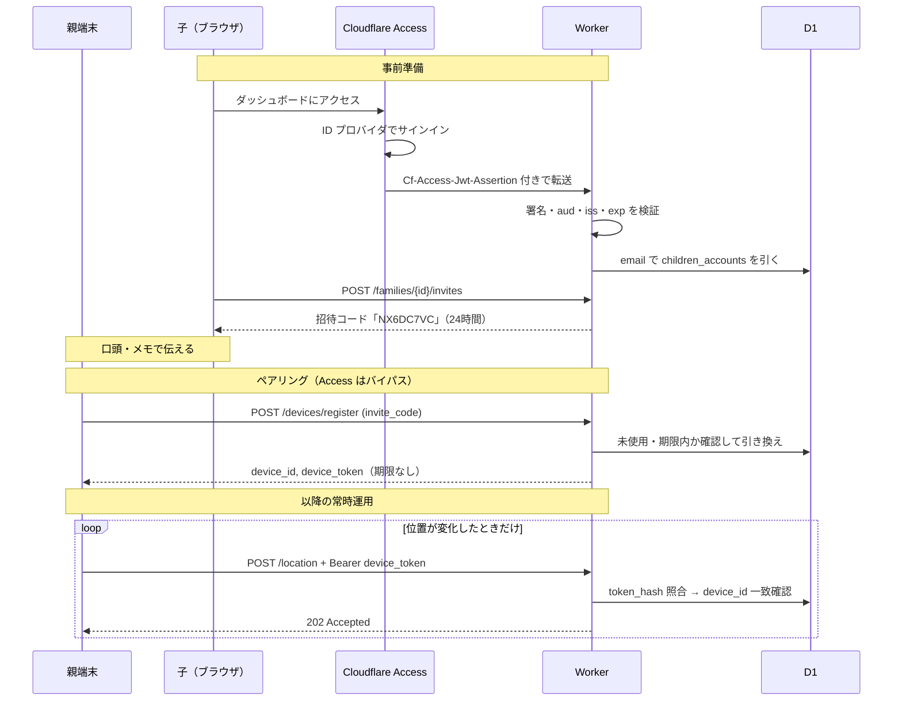

# 認証・認可の設計

対象: `server/`（Cloudflare Workers / Rust）と、それを呼ぶ `android-app/`・`client/`。
関連: CLAUDE.md §5（プライバシー・セキュリティ）、[architecture-decisions.md](architecture-decisions.md)

このドキュメントは「なぜその方式にしたか」を残すためのもの。
API の呼び出し方そのものは `server/README.md` を参照。

> **改訂履歴**: 初版は自前のパスワード（Argon2id）とセッショントークンを
> 持つ設計だった。ADR-3 により子アカウントの認証を Cloudflare Access に
> 委ねたため、その部分を全面的に書き換えている。親端末側の設計は変わっていない。

---

## 1. 方針

登場人物は2種類で、性質がまったく違う。

| | 親端末（Android） | 子アカウント（ダッシュボード） |
|---|---|---|
| 主体 | 機械。人が操作しない | 人。ブラウザから操作する |
| 頻度 | 位置が動いたときだけ、断続的 | 見たいときに随時 |
| 再認証 | **できない**（高齢の親に再入力させられない） | できる（Access のサインイン画面が出る） |
| 失われ方 | 端末の紛失・機種変更 | 共用PCへの放置、アカウント乗っ取り |

この違いから、**両者を同じ資格情報で扱わない**。
親端末には期限のない専用トークンを配り、子アカウントは Cloudflare Access に委ねる。

結果として **認証経路が主体ごとに完全に分かれる**。参照する仕組みが違うため、
片方の資格情報でもう片方の API を叩くことは構造上できない。

---

## 2. 資格情報の一覧

| | 親端末 `device_token` | 子アカウント | 招待コード |
|---|---|---|---|
| 発行元 | `POST /devices/register` | Cloudflare Access | `POST /families/{id}/invites` |
| 実体 | OS乱数32バイトのhex（64文字） | Access の JWT (RS256) | 8文字 |
| 保存形式 | **SHA-256 hex** | **保存しない** | 平文 |
| 有効期限 | なし | Access のセッション設定 | 既定24時間 |
| 失効手段 | revoke API | Access のポリシー変更 | 使用済み・期限切れ |
| 送り方 | `Authorization: Bearer` | `Cf-Access-Jwt-Assertion`（Cloudflare が付与） | リクエスト本文 |

`device_token` は**原文を DB に保存しない**。発行時の応答で一度返すきりで、
サーバーには SHA-256 しか残らない。DB が漏れても、そこから成りすませる
トークンは復元できない。入力が32バイトの一様乱数なので、パスワードのような
ストレッチ（Argon2 等）は不要と判断して素の SHA-256 にしている。

**パスワードは一切保存していない。** Access が認証を担うため、
`children_accounts` にはメールアドレスと表示名しか無い。

**招待コードだけは平文で保存している。** 8文字と短くハッシュ化しても
辞書化に耐えないため、防御は「短い有効期限」と「一回きり」に寄せている。
ここは強度を保存形式で稼げない箇所だと認識した上での判断。

---

## 3. Cloudflare Access による子アカウントの認証

### なぜ委ねたか

自前で持つと、レート制限・パスワードリセット・セッション管理・
ハッシュの安全な保管を全部自分で埋めることになる。家族数人のシステムで
それらを正しく維持し続けるより、Cloudflare に寄せたほうが安全（ADR-3）。

### JWT は自分で検証する

Worker が Static Assets を持つ場合、**Access のコンテキスト (`ctx.access`) は
Worker に渡らない**ことが Cloudflare のドキュメントに明記されている。
したがって `src/access.rs` が `Cf-Access-Jwt-Assertion` の JWT を自分で検証する。

**ヘッダを読むだけでは不十分。** 署名を検証しないと、そのヘッダを付けた
リクエストを直接投げるだけで誰でもなりすませる。

検証する項目:

| # | 内容 | 落ちたとき |
|---|---|---|
| 1 | `alg` が `RS256`（JWT 側の申告に従わない） | 401 |
| 2 | `kid` に対応する鍵が JWKS にある | 401 |
| 3 | `{TEAM_DOMAIN}/cdn-cgi/access/certs` の公開鍵で署名が正しい | 401 |
| 4 | `aud` が Access アプリケーションの AUD タグと一致 | 401 |
| 5 | `iss` がチームドメインと一致 | 401 |
| 6 | `exp` が未来 | 401 |
| 7 | `common_name` が無い（＝サービストークンではない） | 401 |

**1 が重要**: `alg` を JWT の申告どおりに扱うと、`none` や `HS256` への
差し替えで署名検証を無力化できる。RS256 以外は無条件で拒否する。

**7 について**: Access のサービストークンでも JWT は発行される（`sub` が空で
`common_name` が入る）。ダッシュボードは人が使うものなので機械の資格情報は
受け付けない。

JWKS は毎リクエスト取りに行かず、Cloudflare のキャッシュに1時間預ける。
鍵のローテーションには追随する。

### Access を通っても、それだけでは足りない

検証済みの `email` で `children_accounts` を引き、**この表に無いメールは 403**
（`not_provisioned`）にする。Access のポリシーとこの表の二重で絞ることで、
Access の設定を誤って広げてしまった場合の影響を抑える。

---

## 4. 親端末は Access の外に置く

Android アプリは対話的ログインができない。Access がサインイン画面を返した
瞬間にアプリは動かなくなる。したがって以下は **Access のバイパス**に設定する。

```
POST /api/v1/devices/register   ← 招待コード（一回きり）で守る
POST /api/v1/location           ← Bearer device_token で守る
GET  /api/v1/healthz            ← 何も返さない
```

> **設定ミスが直接穴になる箇所。** バイパスを付け忘れるとアプリが止まり、
> 広く開けすぎるとダッシュボードが無防備になる。Access の
> アプリケーション定義は `server/README.md` の表のとおりに保つこと。

---

## 5. リクエストが通る道筋



### 認証は経路の入口で済ませる

`src/auth.rs` の `device()` / `child()` がリクエストから主体を確定させる。
ハンドラはすでに確定した `DeviceAuth` / `ChildAuth` を受け取る。

失効条件（親端末の `revoked_at IS NULL`）は照合クエリの WHERE に入れているので、
**revoke は次のリクエストから即座に効く**。

---

## 6. 認証の後に、さらに2段の認可

資格情報が本物であることと、その操作をしてよいことは別。

### 6.1 なりすまし防止（`routes/location.rs`）

ペイロードの `device_id` と、トークンから引いた `device_id` が
食い違えば **401**。有効なトークンを持っていても、他端末を名乗って
位置を投稿することはできない。

### 6.2 家族スコープ（`ChildAuth::scope()`）

パスの `family_id` がその人の家族と違えば **403 ではなく 404** を返す。

403 は「実在するが権限がない」ことを認めてしまう。UUID を総当たりされた
とき、他家族の存在そのものが漏れる。CLAUDE.md §5 の
「他家族のデータに到達不可」は、存在の秘匿まで含めて満たす。

---

## 7. 招待コードの扱い

```
発行 → 口頭/メモで伝達 → 端末で入力 → 使用済み
```

- **文字集合は27文字**（`0 1 2 B I L O S Z` を除外）。高齢の利用者が
  紙から読み取って入力するため、見間違えやすい文字を最初から入れない
- **入力の正規化**: 大文字小文字、ハイフン、空白を無視して照合する。
  `a3c4-d5e6` と `A3C4D5E6` は同じものとして扱う
- **一回きり**: D1 の `batch`（SQL トランザクション）の中で、
  条件付き INSERT と EXISTS 付き UPDATE を組み合わせる。**両方が 1 行の
  ときだけ成立**とみなすので、同時に同じコードを使われても片方しか通らず、
  「端末だけ作られた」「コードだけ消費された」のどちらも起こらない

> D1 の `batch` がロールバックするのは**文が失敗したとき**だけで、
> 「更新 0 行」では起きない。行数で判定しているのはこのため。

組み合わせは 27^8 ≒ 2.8e11 通り。**レート制限が無いため、防御は
有効期限の短さに依存している**（§10 参照）。

---

## 8. ステータスコードとクライアントの挙動

Android の `ApiClient.kt` / `UploadWorker.kt` の分岐がこれに依存している。
**サーバー側でコードを変えるとアプリの再送ロジックが変わる。**

| コード | 状況 | アプリの挙動 |
|---|---|---|
| 202 | 位置情報を受理 | キューから削除 |
| 400 | 時刻・座標・電池残量が不正 | 再試行を打ち切って捨てる |
| 401 | トークン失効 / 招待コード不正 / なりすまし / JWT 不正 | ペアリングし直し |
| 403 | Access は通ったが未登録のメール | ― |
| 404 | 他家族の ID を指した | ― |
| 5xx | サーバー側の問題 | 時間をおいて再送 |

401 を「招待コード不正」にも使っているのは、アプリが `Unauthorized` を
受けたときに自前の日本語文言（`pairing_error_invalid_code`）を出す
実装になっているため。逆に 4xx の `message` は高齢の利用者の画面に
そのまま出るので、日本語で専門用語を避けて書く。

---

## 9. ライフサイクルと掃除

Cron Trigger（6時間ごと）が `src/retention.rs` を呼ぶ。

| 対象 | 削除条件 |
|---|---|
| 位置履歴 | `recorded_at` が保持期間（既定90日）より古い |
| 招待コード | 未使用のまま期限切れ |

使用済みの招待コードは残す（どの端末がどのコードで登録されたか辿れる）。
親端末は revoke されても行は残り、`revoked_at` が入るだけ。

子アカウントのセッションはサーバー側に無い（Access が管理する）ので、
掃除の対象にならない。

---

## 10. 既知の限界

実装した上で「今は受け入れている」もの。

| 項目 | 現状 | 影響 |
|---|---|---|
| **レート制限が無い** | 未実装 | 招待コード発行・端末登録の総当たりを止められない。**公開前に塞ぐべき最優先項目**（Cloudflare の Rate Limiting Rules で対処可能） |
| `device_token` に期限が無い | revoke でのみ失効 | 端末紛失に気づかない限り送信が続く |
| トークン照合が定数時間比較でない | SHA-256 の主キー検索 | 入力が高エントロピーの乱数なので実害は無いと判断 |
| 招待コードを平文保存 | §2参照 | DB 漏洩時、期限内の未使用コードが使える |
| 監査ログが無い | 構造化ログのみ | 「誰がいつ位置を見たか」を後から追えない |
| Access への依存 | 認証が Cloudflare 前提 | Access をやめる場合はログイン機能を作り直すことになる |

ログイン試行のレート制限とパスワードリセットは、Access に委ねたことで
**自分の課題ではなくなった**（初版の限界から消えた項目）。

---

## 11. 対応するコードとテスト

| 内容 | 実装 |
|---|---|
| Access JWT の検証 | `server/src/access.rs` |
| 主体の確定（device / child） | `server/src/auth.rs` |
| トークン生成・ハッシュ・招待コード | `server/src/token.rs` |
| ペアリング | `server/src/routes/devices.rs` |
| なりすまし防止 | `server/src/routes/location.rs` |
| 家族スコープ | `server/src/routes/families.rs` |
| 掃除 | `server/src/retention.rs` |
| 経路とバイパス対象の一覧 | `server/src/lib.rs` |

この設計を固定しているテスト（`server/tests/e2e.mjs`）。
**Access の検証は迂回せず、テスト用の RSA 鍵で本物と同じ経路を通している。**

- 招待コードは一度しか使えない
- 招待コードは小文字・ハイフン混じりでも通る
- 他端末になりすました投稿は 401
- 他家族のデータには到達できない（403 ではなく 404）
- 端末トークンではダッシュボード API を叩けない
- 署名を改ざんした JWT は 401
- **クレームだけ差し替えた JWT は 401**
- 期限切れ / `aud` 違い / `iss` 違い / 知らない `kid` の JWT は 401
- サービストークンの JWT は 401
- Access は通るが未登録のメールは 403
- 無効化した端末は送信できなくなる

**この設計を変えるときは、上のテストを先に直すこと。**
どれも「なぜそうなっているか」がテスト名に書いてある。
